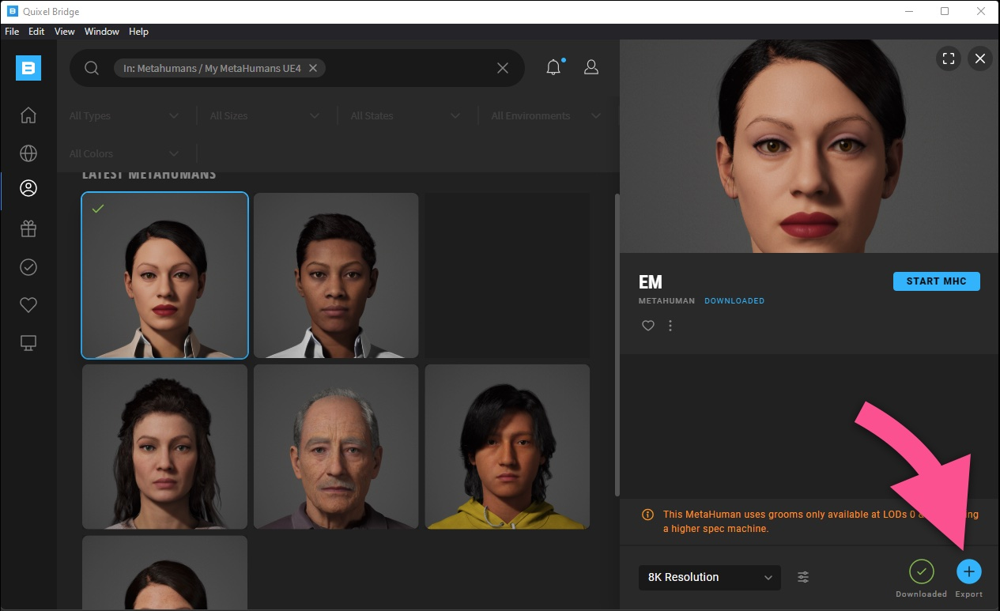

# Developer Guide

This guide will walk you through everything you need to know about how this project is implemented and how to customize it for your own use.

**Contents**

- [How It Works](#how-it-works)
- [Project Architecture](#project-architecture)
- [Adding New MetaHumans](#adding-new-metahumans)
- [Readying for Production](#readying-for-production)


## How It Works

Amazon Polly provides two important capabilities that make this project work. First, Polly can turn text into natural sounding speech delivered as an audio file. Second, Polly can generate a JSON-formatted list of mouth shapes corresponding to the sounds in that audio file. These mouth shapes are called "visemes".  Here are what the visemes for the word "human" look like...

```
{"time":6,"type":"viseme","value":"k"}
{"time":108,"type":"viseme","value":"i"}
{"time":166,"type":"viseme","value":"u"}
{"time":207,"type":"viseme","value":"p"}
{"time":287,"type":"viseme","value":"@"}
{"time":351,"type":"viseme","value":"t"}
{"time":500,"type":"viseme","value":"sil"}
```

Because this viseme data includes timestamps for each mouth shape, we can use that information to achieve believable lip sync between the audio playback and MetaHuman facial animations.

This UE4 project includes a hand-crafted set of animation assets representing each of the possible visemes. It also includes an Animation Blueprint that automatically blends between these viseme animations as audio playback progresses, making it easy to add Polly speech animation to any MetaHuman character.

Let's dive deeper into the architecture of this project.


## Project Architecture

The project's implementation includes four key elements:

- A new Actor Component called "**Speech**"
- Logic added to the main MetaHuman Blueprint, utilizing the **Speech** component
- An Animation Blueprint called "**Speech_Anim_BP**"
- A pre-compiled version of the **Amazon Polly C++ SDK**

Let's look at each in detail.


### Speech Actor Component

The **Speech** component exposes a simple, Blueprint-friendly API for interacting with Amazon Polly. It also  manages the state of the speech as it plays back. This component can be added to any MetaHuman Blueprint.

The methods that the **Speech** component exposes to Blueprint are:

***GenerateSpeech()*** - An asynchronous function that takes a string and a Polly voice ID as input and generates both the audio and the viseme data for the resulting speech.

***StartSpeech()*** - Starts playback of the previously generated speech. This function immediately returns the speech's audio as a **USoundWaveProcedural** object. Note, this method should only be called after *GenerateSpeech()* has completed.

***IsSpeaking()*** - Returns a boolean value indicating whether a speech is currently playing.

***GetCurrentViseme()*** - Returns the currently active viseme during speech playback. This value is used to drive the Animation Blueprint (discussed later).

To see the **Speech** component in use, open the  **/Content/AmazonPollyMetaHuman/Ada/BP_Ada** Blueprint. The **Speech** component will be listed in the Components panel.


> ✏️ **Note:** The Speech component is implemented as a C++ class, `USpeechComponent`. The relevant files are [SpeechComponent.h](../Source/AmazonPollyMetaHuman/Public/SpeechComponent.h) and [SpeechComponent.cpp](../Source/AmazonPollyMetaHuman/Private/SpeechComponent.cpp).


### MetaHuman Blueprint Logic

Open the **BP_Ada** asset (/Content/AmazonPollyMetaHuman/Ada/BP_Ada) to see the custom logic that has been added to this MetaHuman Blueprint. The **Speech** component's functions are called to generate the speech and then start speech playback, including playing the speech audio using the standard ***Play Sound 2D*** function.


### Animation Blueprint

The **Speech_Anim_BP** Animation Blueprint is responsible for monitoring the state of the **Speech** component and updating the MetaHuman's facial animation to match. Open the **/Content/AmazonPollyMetaHuman/Animation/Speech_Anim_BP** asset to explore further.

On the left side of the Animation Blueprint Editor you can see that this Blueprint defines a **"Viseme"** variable.


The **Speech_Anim_BP** keeps this variable constantly up-to-date to reflect the state of the **Speech** component. It does this by calling the ***GetCurrentViseme()*** method on the **Speech** component as shown below (viewing the Event Graph tab).


If you switch to the AnimGraph tab you will see that we're using that **"Viseme"** variable to drive a **Blend Pose** node. It is this node that determines which one of the possible viseme animation assets will be applied to the MetaHuman's face.


### Amazon Polly C++ SDK

The `USpeechComponent` class communicates with the Amazon Polly service using the C++ Polly API. This API is part of the [AWS SDK for C++](https://aws.amazon.com/sdk-for-cpp/). You compiled the C++ Poly API as part of the Quick Start. The compiled files can be found at /Source/AmazonPollyMetaHuman/ThirdParty/AwsSdk/.


## Adding New MetaHumans

This project includes a sample MetaHuman, Ada, but it's easy to modify the project to use your own custom MetaHumans.

### 1. Create and import a new MetaHuman

Use Epic's [MetaHuman Creator](https://www.unrealengine.com/en-US/metahuman-creator), being sure to select the "original" UE4 version, to create your MetaHuman. You will then use Quixel [Bridge](https://quixel.com/bridge) to import your new MetaHuman into the project by following these steps...

Install and configure Quixel Bridge. Refer to the [MetaHuman Creator documentation (Legacy UE4 version)](https://docs.metahuman.unrealengine.com/en-US/legacy-documentation-for-metahumans-in-unreal-engine-4/) if you need help installing Quixel Bridge and the Quixel Bridge plugin for UE4.

Open your Unreal Engine project if it isn't already open.

In Quixel Bridge, navigate to the custom MetaHuman you would like to use. Choose "Export" to add it to the project. (If you haven't already downloaded the MetaHuman inside of Bridge you'll have to do that first.)



After the export completes, switch back to Unreal Engine and you'll see this prompt:


Note the "FROM" file path (jot it down if you have to). Close Unreal Engine, and then use Windows Explorer to copy the indicated "asset_ue/MetaHumans" folder into the project's "Content" folder, choosing to replace existing files.


You can now re-open the Unreal Engine project and it will contain your custom MetaHuman, ready for the next steps below.

### 2. Assign the "Speech_AnimBP" to your MetaHuman

Open the Blueprint of your MetaHuman. Example: **/Content/MetaHumans/Koda/BP_Koda**

In the Components tab, select the **Face** component. Then, in the Details panel, scroll to the "Animation" section, and set the ***Anim Class*** property to "Speech_AnimBP".


### 3. Add speech logic to your MetaHuman

With the MetaHuman Blueprint still open for editing, in the Components tab, add a **Speech** component.


Select the Event Graph tab if it isn't already displayed.

We want to trigger some new logic from the BeginPlay event, but we also want to retain the logic that is already connected to that event. To do this, insert a **Sequence** node...


Add a **Speech** component reference to the Blueprint by drag-dropping the **Speech** component from the Components tab to the Event Graph tab. Then, create the logic graph shown below. Alternatively, you can copy the text from [this file](code/metahuman-blueprint-nodes.txt) and paste it directly into the Blueprint window to automatically recreate these nodes.


On the **Generate Speech** node, fill in the ***Text*** parameter with the text you would like your MetaHuman to speak. Set ***Voice Id*** to the Polly voice you would like your MetaHuman to use.


Congratulations! Your MetaHuman is now ready to use. Just add it to a map and start playback.

### 4. (Optional) Add body animation

Your MetaHuman will look pretty stiff and unnatural at this point. You can greatly improve the realism by adding an idle animation to the MetaHuman's body. In the Components tab, select the **Body** component. Then, in the Details panel, scroll to the "Animation" section. Ensure that the ***Animation Mode*** is set to "Use Animation Asset" and set the ***Anim to Play*** property to "BodyIdle".


## Readying for Production

Before you can package a build of this project for distribution to your end users you will need to implement your own solution for managing AWS service credentials and service access. The way service access is implemented in this sample project was intentionally kept simple to make it as easy as possible for you to get started. However, since the implementation relies on each user having their own AWS account credentials and having installed and configured the AWS CLI, it is not a practical approach for use in production.

Each project has different requirements for authentication and access control. Your team is best equipped to design and implement a solution that fits your application's specific needs. You may want to consider using Amazon Cognito as part of your solution. Amazon Cognito is often used to deliver temporary, limited-privilege credentials to native applications including games and other native apps. A good place to learn more is the ["Getting Credentials"](https://docs.aws.amazon.com/cognito/latest/developerguide/getting-credentials.html) section of the Amazon Cognito documentation.
